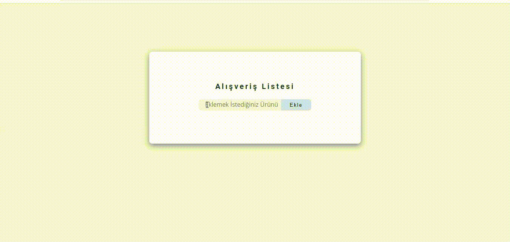

# Crud-Main

This is a simple web application for managing a shopping list. Users can add, edit, and delete items from the list and clear the entire list when needed.

<h1>Table of Contents</h1>
Features
Technologies Used
Setup
Usage
Contributing
License

<h1>Features</h1>
Add items to the shopping list.
Edit existing items.
Delete items from the list.
Clear the entire list.

<h1>Technologies Used</h1>
HTML
CSS
JavaScript
Setup

